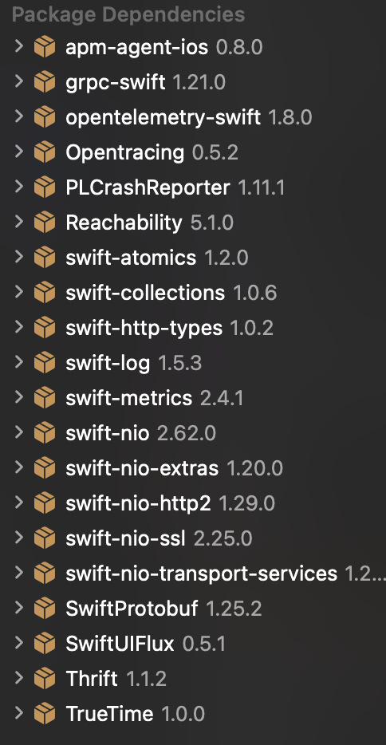
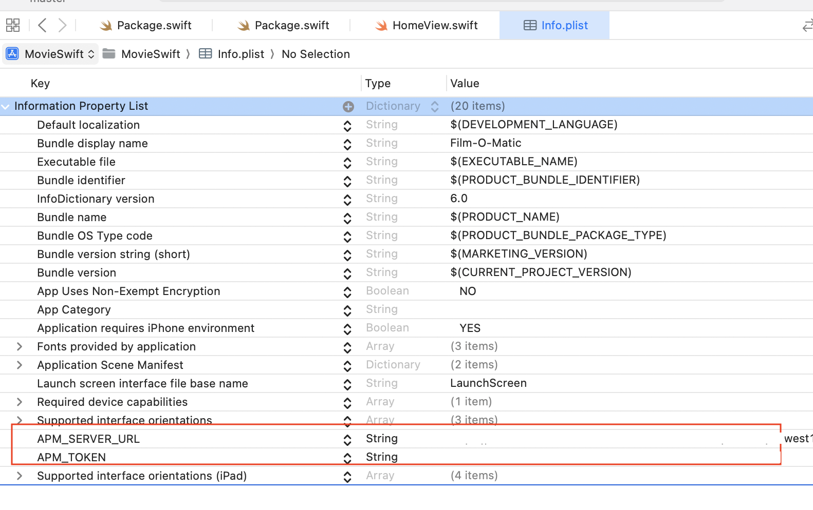
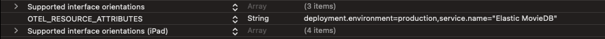

# Quick start iOS Elastic APM Demo

<!-- vscode-markdown-toc -->
* 1. [Install XCode](#InstallXCode)
* 2. [Demo application](#Demoapplication)
	* 2.1. [Manual Building](#ManualBuilding)
		* 2.1.1. [Download the application repository](#Downloadtheapplicationrepository)
		* 2.1.2. [Select the destination build](#Selectthedestinationbuild)
		* 2.1.3. [Add the APM Dependency](#AddtheAPMDependency)
	* 2.2. [Make the application crash](#Maketheapplicationcrash)
	* 2.3. [ Use instrumented version](#Useinstrumentedversion)
* 3. [Configure & Build the application](#ConfigureBuildtheapplication)
* 4. [Additional Notes](#AdditionalNotes)
	* 4.1. [Change iOS version or device](#ChangeiOSversionordevice)
* 5. [Reference](#Reference)

<!-- vscode-markdown-toc-config
	numbering=true
	autoSave=true
	/vscode-markdown-toc-config -->
<!-- /vscode-markdown-toc -->

##  1. <a name='InstallXCode'></a>Install XCode

In order to showcase the RUM integration within iOS, we will leverage iOS XCode simulator capabilities to emulate an iOS environment.

Please follow the following steps:

1. Install [XCode](https://apps.apple.com/us/app/xcode/id497799835?mt=12) through Apple App Store
2. Download & Install iOS Platform : Go to XCode -> Navigate to Settings -> Platforms -> Select iOS
3. Add an Apple Account to your Xcode preferences : Got to Xcode -> Settings -> Accounts -> "+" This is necessary to build and sign the generated package.

We have the requirements to show case the RUM integration.

##  2. <a name='Demoapplication'></a>Demo application

###  2.1. <a name='ManualBuilding'></a>Manual Building

####  2.1.1. <a name='Downloadtheapplicationrepository'></a>Download the application repository

First download the application from the following repository

```bash
git clone https://github.com/Dimillian/MovieSwiftUI.git
```

Open the downloaded repository in XCode.

####  2.1.2. <a name='Selectthedestinationbuild'></a>Select the destination build

In this demo we are going to use the simulator to showcase our instrumented application, so for this select the expect iOS simulator device version you want to. For this go to "product" -> Destination -> iPhone 15 and it will download the latest runtime version of iOS for iPhone15.

! Note : If you want to have more iOS version you can hit the "+" button and download the version you want to demo on.

Now you can build the project by hitting the play button at the top.

The first time you build the project it will complain that the version of the project is old and ask to update it. You can safely do it.

####  2.1.3. <a name='AddtheAPMDependency'></a>Add the APM Dependency

Now the application is building, we are going to add the Elastic APM package as a dependency in our project. For this you will have to update Package dependencies under repositoy project:
MovieSwift -> Packages -> UI -> Package.swift

! Note : Documentation is wrong, _name_ statement under dependencies is not supported

```swift
// swift-tools-version:5.1
// The swift-tools-version declares the minimum version of Swift required to build this package.

import PackageDescription

let package = Package(
    name: "UI",
    platforms: [
        .iOS(.v13),
        .macOS(.v10_15),
        .tvOS(.v13),
        .watchOS(.v6)
    ],
    products: [
        .library(name: "UI", targets: ["UI"]),
    ],
    dependencies:[
        .package(
            url: "https://github.com/elastic/apm-agent-ios.git",
            from: "1.0.0"),
    ],
    targets: [
        .target(
            name: "UI",
            dependencies: [
                .product(name: "ElasticApm", package: "apm-agent-ios")
            ],
            path: "Sources")
    ],
    swiftLanguageVersions: [
        .version("5.2")
    ]
)

```

Once downloaded you will see XCode download all the dependcies from the elastic-apm-ios agent


Now we are going to instrument the code.

Change the following code :
MovieSwift -> MovieSwift -> views -> components -> home -> Homeview

And modify the code to reflect the following changes as per _Elastic Modification Comments_:

```swift
import SwiftUI
import SwiftUIFlux
// Elastic Modification : import module
import ElasticApm
import MetricKit
// End Elastic Modification

// MARK:- Shared View

let store = Store<AppState>(reducer: appStateReducer,
                            middleware: [loggingMiddleware],
                            state: AppState())
// Elastic Modification : Setup the configuration of the iOS Elastic Agent APM
class AppDelegate : NSObject, UIApplicationDelegate {
    func application(_ application: UIApplication, didFinishLaunchingWithOptions launchOptions: [UIApplication.LaunchOptionsKey : Any]? = nil) -> Bool {
        // Elastic APM
        if let serverURLString = Bundle.main.object(forInfoDictionaryKey: "APM_SERVER_URL") as? String, let secretToken = Bundle.main.object(forInfoDictionaryKey: "APM_TOKEN") as? String {
            if let serverURL = URL(string: serverURLString) {
                let config = AgentConfigBuilder()
                    .withServerUrl(serverURL)
                    .withSecretToken(secretToken)
                    .build()
                    
                ElasticApmAgent.start(with: config)
            }
        }
        // End Elastic APM
        // MetricKit implementation
        let metricManager = MXMetricManager.shared
        metricManager.add(self)
        // End MetricKit implementation
        return true
    }
}
// End Elastic Modification
@main
struct HomeView: App {
    // Elastic Modification : Load the Agent
    @UIApplicationDelegateAdaptor(AppDelegate.self) var appDelegate
    // End Elastic Modification
```

###  2.2. <a name='Maketheapplicationcrash'></a> Make the application crash

In order to grab the crash stacktrace you can apply the following modification to make the application crash when clicking the _fan Club_ option located on the tab at the bottom of the app.

Change the following code :
MovieSwift -> MovieSwift -> views -> components -> fan club -> FanClubHome

And modify the code to reflect the following changes as per _Elastic Modification Comments_:

```swift
...
   func map(state: AppState , dispatch: @escaping DispatchFunction) -> Props {
        // Elastic Modification : Crach the application on click   
        fatalError("A Crash!")  
        // End Elastic Modification
        Props(peoples: state.peoplesState.fanClub.map{
...
```

###  2.3. <a name='Useinstrumentedversion'></a> Use instrumented version

You can leverage the existing code and just build and configure the demo app without going through the above manual modification process.
For this, you can clone the following repository which contains already the above modifications:

```bash
git clone https://github.com/fred-maussion/MovieSwiftUI.git
```

And open it in Xcode, that will download the dependencies and you will be good to go the next step.

##  3. <a name='ConfigureBuildtheapplication'></a>Configure & Build the application

Finally you can configure the parameters to reflect your environment, for this modify the Info.plist located under _MovieSwift -> Info.Plist_ and add the two variable with their respective content:

1. APM_SERVER_URL : Your APM Elastic Endpoint
2. APM_TOEKN : Your APM Token



If you want to add additional attributes or override the existing one you can leverage _OTEL_RESOURCE_ATTRIBUTES_ within the _Info.Plist_ as per this example:

OTEL_RESOURCE_ATTRIBUTES : deployment.environment=production,service.name="Elastic MovieDB"



Now let's build the application again who will be updated to your simulator device and perform a couple of action. You will see the traces appear in the APM feature of your ESS deployement and the metrics from the iPhone will be in your _metrics-apm.app*_ index

##  4. <a name='AdditionalNotes'></a>Additional Notes

###  4.1. <a name='ChangeiOSversionordevice'></a>Change iOS version or device

If you want to change your iOS version or device, before you build, your need to go to:
Product -> Destination -> Manage Destination -> Select the device you want to build on.

Now if you want to change the version of a device, your need to go to:
Product -> Destination -> Manage Destination -> Hit "+" and select the Device + OS Version you want to test on.

You can also use your personal iPhone if you have one, you will need to enable the [developper mode](https://developer.apple.com/documentation/xcode/enabling-developer-mode-on-a-device)

##  5. <a name='Reference'></a>Reference

- [Apple Simulator](https://developer.apple.com/documentation/xcode/installing-your-app-in-many-simulator-platforms-and-versions)
- [Elastic APM Instrumentation](https://www.elastic.co/guide/en/apm/agent/swift/main/Instrumentation.html) 